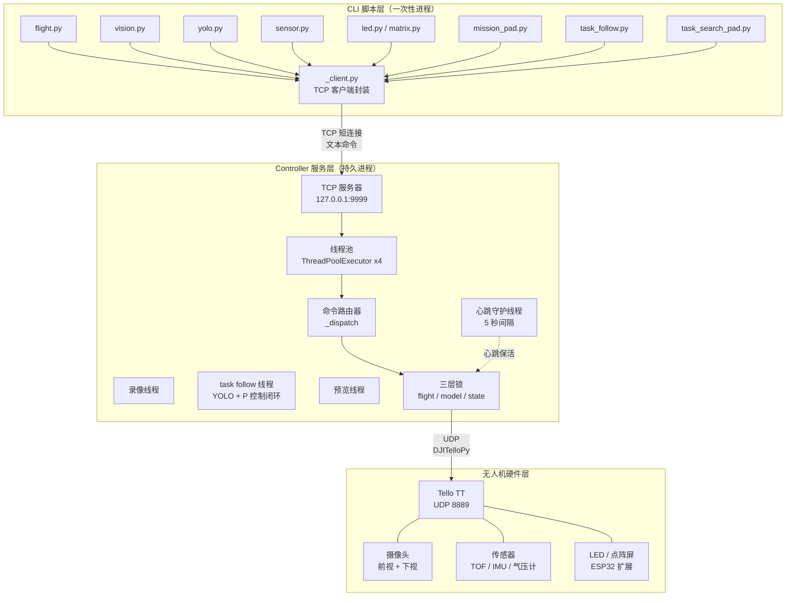
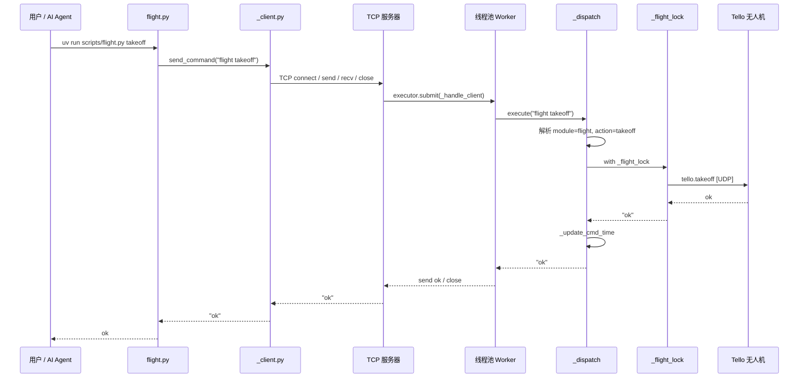
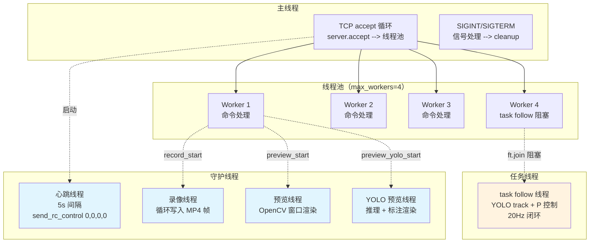
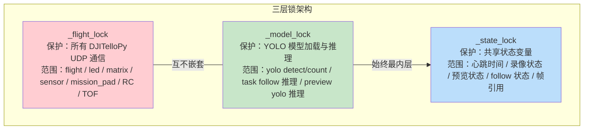
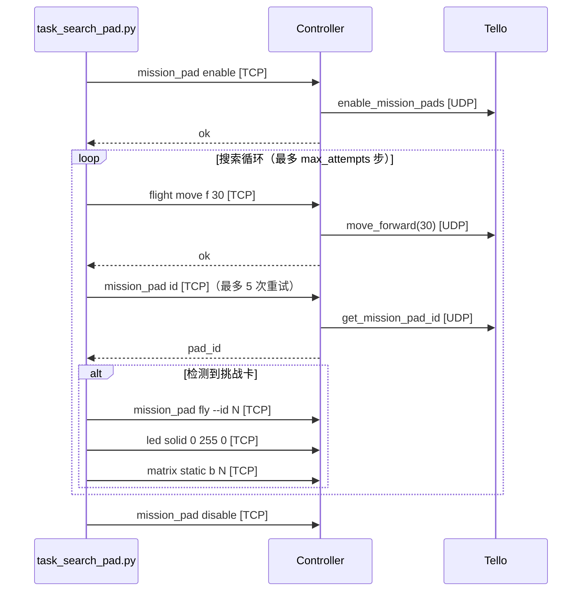
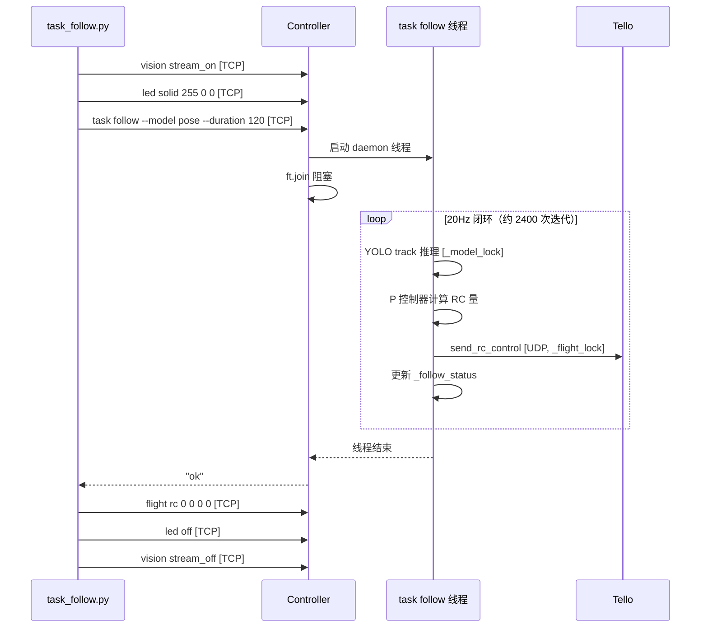
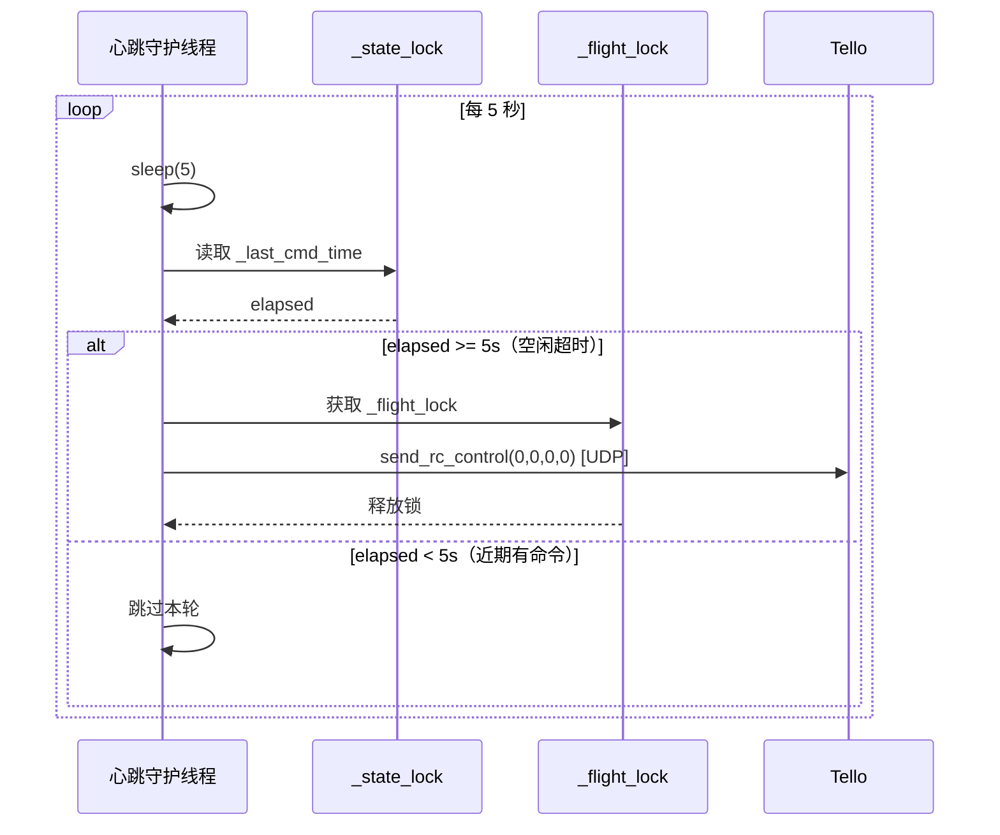

# Tello 无人机控制技能

Agent 技能，通过自然语言控制 Tello Talent 无人机，支持飞行、拍摄、LED、挑战卡、YOLO 检测、视觉跟踪等功能。

## 快速开始

```bash
# 克隆仓库
git clone https://github.com/FallThrive/tello-skills.git
cd tello-skills

# 安装依赖
uv sync

# 注册技能（让 Claude Code 发现并加载）
mkdir -p .claude/skills/tello
ln -s ../../../SKILL.md .claude/skills/tello/SKILL.md

# 或者使用其他 Agent（如 OpenClaw、OpenCode 等）
mkdir -p .agents/skills/tello
ln -s ../../../SKILL.md .agents/skills/tello/SKILL.md

# 启动 controller（后台运行）
uv run scripts/controller.py &

# 起飞
uv run scripts/flight.py takeoff

# 拍照
uv run scripts/vision.py photo --name test.jpg

# 降落
uv run scripts/flight.py land

# 全部任务完成后终止 controller
pkill -f "scripts/controller.py"
```

首次执行脚本前需手动启动 controller，controller 在后台持久运行，`land` 后仅降落无人机，controller 进程继续运行。所有命令格式为 `uv run scripts/<模块>.py <子命令> [--参数]`，详见 [SKILL.md](SKILL.md)。

## 技能注册

AI Agent（Claude Code、Trae 等）通过扫描 `.claude/skills/` 或 `.agents/skills/` 目录发现技能。克隆仓库后需创建软链接：

```bash
# Claude Code
mkdir -p .claude/skills/tello
ln -s ../../../SKILL.md .claude/skills/tello/SKILL.md

# 其他 Agent（如 OpenClaw、OpenCode）
mkdir -p .agents/skills/tello
ln -s ../../../SKILL.md .agents/skills/tello/SKILL.md
```

软链接指向项目根目录的 `SKILL.md`，执行命令时工作目录为项目根目录，`scripts/` 路径可直接解析，无需额外链接。

## 功能概览

### 飞行控制

起飞、降落、六向移动（前/后/左/右/上/下）、旋转（顺/逆时针）、RC 摇杆实时控制。所有飞行命令通过 DJITelloPy 的 UDP 协议发送，由 controller 进程串行化执行，避免命令冲突。详见 [SKILL.md - flight.py](SKILL.md)。

### LED 与点阵屏

LED 支持常亮、呼吸、闪烁三种模式，可自定义颜色和频率。8x8 点阵屏支持滚动文字和静态字符显示（单字符），颜色可选红/蓝/紫。LED 和点阵屏通过 ESP32 扩展命令控制，与飞行命令使用不同的通信通道。详见 [SKILL.md - led.py / matrix.py](SKILL.md)。

### 传感器

7 项传感器数据：电量百分比、TOF 激光测距（mm）、姿态角（pitch/roll/yaw）、三轴加速度、相对起飞高度、累计飞行时长、气压计高度。传感器查询不重置心跳计时器，可安全频繁调用。详见 [SKILL.md - sensor.py](SKILL.md)。

### 视觉系统

视频流开关、拍照（保存至 `images/`）、录像（保存至 `videos/`，MP4 格式，30 FPS）。支持前视和下视两个摄像头的纯净实时预览窗口，以及叠加 YOLO 检测框的标注预览窗口。录像在 `land` 时自动停止。详见 [SKILL.md - vision.py](SKILL.md)。

### YOLO 检测与跟踪

基于 Ultralytics YOLO26 的实时人员检测，支持 `pose`（躯干高度）和 `seg`（分割面积）两种模型。检测结果包含边界框、中心坐标和 BoT-SORT 跟踪 ID。BoT-SORT 追踪器使用 ReID 外观特征，支持遮挡后重识别。详见 [SKILL.md - yolo.py](SKILL.md)。

### 挑战卡

识别 Tello 挑战卡（ID 1-8），获取相对三维坐标，可直接飞至指定挑战卡正上方。挑战卡检测由 SDK 底层实现，不依赖视频流。详见 [SKILL.md - mission_pad.py](SKILL.md)。

### 闭环任务

- **人员跟随** (`task_follow.py`)：YOLO + P 控制器闭环，20Hz 控制频率，支持 TOF 紧急停止，controller 内部运行消除 TCP 延迟
- **方向搜索挑战卡** (`task_search_pad.py`)：面向指定方向小步飞行，每步后检测挑战卡，发现后飞至正上方

详见 [SKILL.md - tasks/](SKILL.md)。

## 依赖

- Python >= 3.10
- [DJITelloPy](https://github.com/damiafuentes/DJITelloPy) — Tello 无人机 SDK
- [Ultralytics YOLO26](https://github.com/ultralytics/ultralytics) — 实时人员检测
- PyTorch + torchvision

## 项目结构

```
scripts/
  controller.py       # 持久 TCP 服务器，通过 DJITelloPy 与无人机通信
  _client.py          # CLI 脚本共用的 TCP 客户端封装
  flight.py           # 飞行控制（起飞、降落、移动、旋转、速度控制）
  led.py              # LED 彩灯（常亮、呼吸、闪烁）
  matrix.py           # LED 点阵屏（滚动、静态显示）
  sensor.py           # 传感器（电量、TOF、姿态、加速度、高度等）
  vision.py           # 视觉（视频流、拍照、录像、预览窗口）
  yolo.py             # YOLO 人员检测与 BoT-SORT 跟踪
  mission_pad.py      # 挑战卡识别
  tasks/
    task_follow.py      # 实时人员跟随（服务端闭环脚本）
    task_search_pad.py  # 方向搜索挑战卡（客户端闭环脚本）
SKILL.md              # 技能定义（AI Agent 运行时加载）
```

## 架构详解

### 整体架构

系统采用三层架构：CLI 脚本层、Controller 服务层、无人机硬件层。所有通信通过文本协议完成。



### 命令执行流程

以 `flight takeoff` 为例，展示一次完整命令的生命周期：



### Controller 线程模型

Controller 进程内部包含多种线程，各自承担不同职责：



**线程职责说明**：

| 线程 | 类型 | 生命周期 | 使用的锁 |
|------|------|---------|---------|
| 主线程 | 用户态 | 进程启动 → cleanup | 无 |
| 线程池 Worker | 用户态 | 进程启动 → cleanup | 按需获取 |
| 心跳守护线程 | daemon | 进程启动 → 进程退出 | `_flight_lock`、`_state_lock` |
| 录像线程 | daemon | record_start → record_stop/land | `_state_lock` |
| 预览线程 | daemon | preview_start → preview_stop | `_flight_lock`（电量查询） |
| YOLO 预览线程 | daemon | preview_yolo_start → preview_yolo_stop | `_model_lock`、`_state_lock` |
| task follow 线程 | daemon | task follow → 超时/stop | `_model_lock`、`_flight_lock`、`_state_lock` |

### 三层锁机制

Controller 使用三层锁确保并发安全。DJITelloPy 通过单一 UDP socket 与无人机通信，并发调用会导致协议混乱，因此必须串行化所有 UDP 操作。



**锁的嵌套规则**：
- `_flight_lock` 和 `_model_lock` **互不嵌套**，避免死锁
- `_state_lock` 始终是最内层锁，持有期间不做网络 I/O 或模型推理
- `_state_lock` 可在 `_flight_lock` 内部获取（如心跳线程读取 `_last_cmd_time`）

**各模块的锁使用**：

| 模块 | _flight_lock | _model_lock | 说明 |
|------|:---:|:---:|------|
| flight | ✅ | - | 飞行操作，同时更新心跳 |
| led / matrix | ✅ | - | ESP32 扩展命令 |
| sensor | ✅ | - | 传感器查询 |
| mission_pad | ✅ | - | fly 时更新心跳 |
| vision (stream/preview) | ✅ | - | 视频流开关 |
| vision (photo/record) | - | - | 仅操作帧缓存 |
| yolo detect | - | - | 一次性推理，无需锁 |
| yolo count | - | ✅ | 需保护模型状态 |
| task follow | ✅ | ✅ | 分别获取，不嵌套 |

### 两种 Task 模式对比

项目中有两种闭环控制模式，通信架构截然不同：

#### task_search_pad — 客户端循环

控制循环在 CLI 脚本进程内运行，每次操作都通过 TCP 与 controller 交互：



**特点**：每次操作一次 TCP 往返，适合低频步进式任务。AI 可在循环间插入判断逻辑。

#### task_follow — 服务端循环

控制循环在 controller 进程内运行，消除 TCP 往返延迟：



**特点**：RC 更新频率从 ~10Hz 提升到 ~20Hz，控制更平滑。task follow 阻塞一个线程池 worker，其余 3 个 worker 仍可接收 `task stop` 等紧急命令。

### 心跳机制

Tello 无人机在 15 秒未收到命令后会自动降落。Controller 通过心跳守护线程防止这一情况：



**心跳时间更新规则**：
- **会重置心跳的操作**：`flight` 全部命令、`mission_pad fly`、`vision stream_on/off`、`vision preview_start/stop`、task follow 循环中的 RC 发送
- **不会重置心跳的操作**：`sensor` 查询、`led` / `matrix` 控制、`vision photo` / `record`、`yolo detect/count`

依据：Tello SDK 3.0 规定 `battery?` 等查询命令不计入 15 秒超时，ESP32 扩展命令（LED/矩阵）走不同通道也不计入。

## 使用其他环境管理工具

本项目默认使用 uv，SKILL.md 中的命令使用 `python` 前缀（环境无关的通用格式）。如果你更熟悉 conda 或 venv，按以下步骤配置后可直接使用 `python` 代替 `uv run`。

### conda

```bash
conda create -n tello python=3.12
conda activate tello
pip install djitellopy ultralytics
# PyTorch 安装请参考 https://pytorch.org/get-started/locally/ 选择对应 CUDA 版本
# 激活环境后直接使用 python 代替 uv run：
python scripts/flight.py takeoff
```

### venv

```bash
python -m venv .venv
source .venv/bin/activate
pip install -e .
python scripts/flight.py takeoff
```

> **注意**：切换环境后，CLAUDE.md / AGENTS.md 中的环境适配规则也需相应调整（将 `uv run` 替换为你实际使用的执行方式），以确保 AI Agent 生成正确的命令。

## 常见问题

### ROS 环境 PYTHONPATH 冲突

如果你的系统中安装了 ROS（如 Humble），其 `setup.bash` 会设置 `PYTHONPATH` 指向 ROS 的 Python 包路径。由于 ROS 也存在一个名为 `scripts` 的包，与项目的 `scripts/` 目录冲突，导致 `from scripts.controller import ...` 报错 `ModuleNotFoundError: No module named 'catkin_pkg'`。

解决方法：在项目根目录创建 `.env` 文件，将项目路径前置到 `PYTHONPATH`：

```bash
cp .env.example .env
```

#### uv

`uv run` 会自动加载项目根目录的 `.env` 文件，无需额外操作：

```bash
uv run scripts/flight.py takeoff
```

#### conda

激活环境后手动加载 `.env`：

```bash
conda activate tello
set -a; source .env; set +a
python scripts/flight.py takeoff
```

或使用 conda 内置变量持久化：

```bash
conda env config vars set PYTHONPATH=".:$PYTHONPATH"
conda deactivate && conda activate tello  # 重新激活以生效
```

#### venv

激活环境后手动加载 `.env`：

```bash
source .venv/bin/activate
set -a; source .env; set +a
python scripts/flight.py takeoff
```

未安装 ROS 的环境中无需以上配置。

## 开发

```bash
uv sync          # 安装依赖
uv add <pkg>     # 添加新依赖
```

添加新功能模块：在 `scripts/controller.py` 中注册路由并实现 handler → 创建 CLI 脚本 → 更新 [SKILL.md](SKILL.md)。

项目 PIN 到 PyTorch CUDA 12.8 版本，国内环境使用清华 PyPI 镜像。
